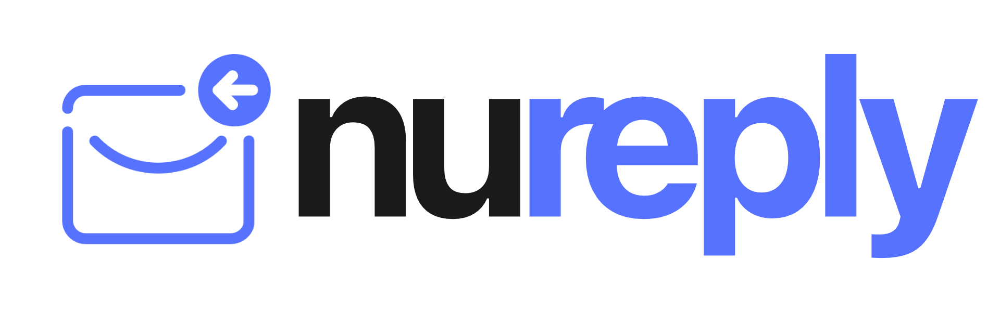

<h1 align='center'>Email Signature Generator for Nureply</h1>

<br>
<br>
<br>

<div align="center">
  <a href="https://nureply.com/">
    
  </a>

  <h3 align="center">
    An awesome email signature generator tool!
  </h3>
</div>

<br>
<br>
<br>


<br>
<br>

## Table Of Content

- [About](#about)
- [Why?](#why)
- [Built With](#built-with)
- [Project Overview](#project-overview)
- [Getting Started](#getting-started)
  - [Prerequisites](#prerequisites)
  - [Installation](#installation)
- [License](#license)
- [Usage](#usage)
- [Supported Email Providers](#supported-email-providers)
- [Project Status](#project-status)
- [Roadmap](#roadmap)
- [Project Team](#project-team)
- [Links](#links)

## About

This is a project that aims to create an email signature generator for Nureply, which will be a free auxiliary tool to create professional email signatures. It has various inputs and ables customizations of them.

## Why?

Email signature generator tool is a valuable tool for individuals and organizations looking to enhance professionalism, maintain brand consistency, and streamline the process of creating and managing email signatures. It offers several benefits that contribute to more effective communication and branding in the digital world.

## Built With

The project team uses the following resources for the project:

- [![Next][Next.js]][Next-url]
- [![React][typescript]][typescriptp-url]
- [![Zustand][zustand]][zustand-url]
- [![Tailwind][tailwind]][tailwind-url]

<p align="right">(<a href="#readme-top">back to top</a>)</p>

## Project Overview

The project consists of the following components:

- Choose a Template
- Customize the Style
- Settle on the Design
- Integrate with Your Email

<p align="right">(<a href="#readme-top">back to top</a>)</p>

<!-- GETTING STARTED -->

## Getting Started

To get a local copy up and running follow these simple steps.

### Prerequisites

You need to have following prerequisites.

- Node.js 16.14 or later

### Installation

_Please follow the below instructions to install and setup the tool._

1. Clone the repo
   ```sh
   git clone https://github.com/nureply/email-signature.git
   ```
2. Install NPM packages
   ```sh
   npm install
   ```
3. Run the app in development mode
   ```sh
   npm run dev
   ```

<p align="right">(<a href="#readme-top">back to top</a>)</p>

<!-- USAGE EXAMPLES -->

## Usage

You can follow below steps to learn how to use the tool.

<br>

Step 1


<br>

Step 2


<br>

Step 3


<br>

Step 4


<br>

Step 5


Step 6


<br>

Step 7


<br>

Step 8


<br>

Step 9


<br>

Step 10


<br>

Step 11


<br>

Step 12


<p align="right">(<a href="#readme-top">back to top</a>)</p>

<!-- ROADMAP -->

<p align="right">(<a href="#readme-top">back to top</a>)</p>

## Supported Email Providers

- [x] Outlook
- [x] Yahoo
- [] Gmail

<p align="right">(<a href="#readme-top">back to top</a>)</p>

## Project Status

The project is completed in (??.??.2023) in a span of (?) months. The project team met every work day to discuss the progress, challenges, and plans for the next day. The project team also communicated regularly through the process.

<p align="right">(<a href="#readme-top">back to top</a>)</p>

## Roadmap

- [x] Outlook compatibility
- [x] Yahoo compatibility
- [ ] Gmail compatibility

## Project Team

The project team consists of three interns who are all from different locations. They are:

- **Onur Doğan**: He is a senior software engineering student at Çankaya Üniversitesi in Ankara, Türkiye. He is interested in front-end development, game design, etc. He is responsible for developing the (...) of the project.
- **Ege Oruç**: He is a (?) computer engineering student at Özyeğin Üniversitesi in İstanbul, Türkiye. He is interested in (?). He is responsible for developing the (...) of the project.
- **Hasan Uğur Ertem**: He is a (?) Management Information Systems student at Medipol Üniversitesi in Ankara, Türkiye. He is interested in (?). He is responsible for developing the (...) of the project.

<p align="right">(<a href="#readme-top">back to top</a>)</p>

## License

The project is licensed under the MIT License.

<p align="right">(<a href="#readme-top">back to top</a>)</p>

<!-- MARKDOWN LINKS & IMAGES -->

[Next.js]: https://img.shields.io/badge/next.js-000000?style=for-the-badge&logo=nextdotjs&logoColor=white
[Next-url]: https://nextjs.org/
[typescript]: https://img.shields.io/badge/typescript-358EF1?style=for-the-badge&logo=typescript&logoColor=white
[typescriptp-url]: https://www.typescriptlang.org/
[tailwind]: https://img.shields.io/badge/Tailwind_CSS-38B2AC?style=for-the-badge&logo=tailwind-css&logoColor=white
[tailwind-url]: https://tailwindcss.com/
[zustand]: https://img.shields.io/badge/zustand-%2320232a.svg?style=for-the-badge&logo=react&logoColor=%2361DAFB
[zustand-url]: https://zustand-demo.pmnd.rs/
